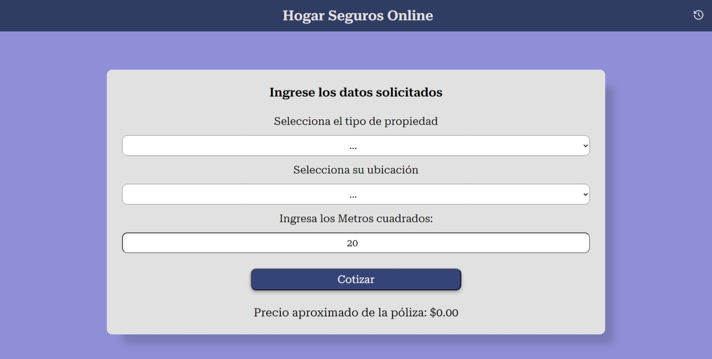

# PROYECTO FINAL UNTREFSCHOOL COTIZADOR DE SEGUROS PARA EL HOGAR

## “Cotizador de seguros para el hogar: una aplicación web con React y Vite”

Este proyecto es una aplicación web que permite a los usuarios obtener una cotización aproximada del seguro de su hogar, basada en el tipo, la ubicación y el tamaño de su propiedad. Lo hice como parte de mi proyecto final de la carrera de full stack en UNTREFSCHOOL, para demostrar mis habilidades en el desarrollo web con React y Vite.

### ¿Cómo esta organizado el proyecto?

Desarrollé mi aplicación con **React** y **Vite**. En el `App.jsx` tengo el `BrowserRouter` de `react-router` que se utiliza para enrutar las solicitudes a los componentes `Home`, `Historial` y `Layouts`.

#### Componente Home

- En el componente Home tengo el componente Header y el componente Formulario.

#### Componente Historial

- El componente `Historial` utiliza el estado para almacenar los datos de las cotizaciones y utiliza el `useEffect` para comprobar si hay datos guardados en el local storage. Si hay datos guardados, el componente los recupera y los muestra en la tabla. Si no hay datos guardados, el componente muestra un mensaje indicando que no hay datos disponibles. El componente también incluye un botón de volver que permite al usuario volver a la página principal.

#### Componente Layouts

- En el componente de Layouts tengo el Outlet.

#### Componente Formulario

En el componente Formulario utilizo:

- El useState() para almacenar el estado de las propiedades y los valores seleccionados en el formulario.
- Se utiliza el hook useEffect() para obtener los datos del archivo data.json y almacenarlos en el estado de propiedades.
- Utilizo el useRef() para obtener los valores ingresados en los campos del formulario.
- Filtro las propiedades para obtener solo las que son de tipo propiedad, lo mismo para las ubicaciones.
- La funcion guardarCotizacion() que se ejecuta cuando se hace clic en el botón de guardar cotización y almacena los datos de la cotización en el estado y en el localStorage.
- Uso el hook useStorage para guardar los datos del formulario en el localStorage.
- El componente tiene un formulario con componentes como Select, Input y Button que se utilizan para ingresar los datos de la cotización.
- Cuando se envía el formulario, se realiza una validación y se muestra una alerta de error si los campos no están completos.
- Luego, se realiza un cálculo del precio del seguro en función de los valores seleccionados y se muestra una alerta de éxito utilizando la librería SweetAlert.
- Después de cerrar la alerta de éxito, se muestra el precio del seguro aproximado y un ícono de guardar, al cual se puede hacer clic en él para guardar los datos en el estado y en el localStorage.

#### Componente Select

El Select es un componente de Formulario que muestra dos selectores desplegables para seleccionar el tipo de propiedad y la ubicacion.

- El componente recibe las propiedades: propiedadesFiltradas , setSelectedPropiedades , propiedadRef , ubicacionesFiltradas , ubicacionRef como propiedades.
- El primer select se utiliza para seleccionar el tipo de propiedad. Utiliza el propiedadRef para obtener el valor seleccionado y el setSelectedPropiedades para actualizar el estado del componente padre con el valor seleccionado.
- El segundo select se utiliza para seleccionar el tipo de ubicación. Utiliza el ubicacionRef para obtener el valor seleccionado y el setSelectUbicacion para actualizar el estado del componente padre con el valor seleccionado.
- Ambos selectores tienen una etiqueta asociada y opciones generadas dinámicamente a partir de las propiedades filtradas recibidas como propiedades.
- Las opciones se generan utilizando un map() para recorrer el array de propiedades filtradas y generar una opcion para cada una.
- Cada opción tiene un valor igual al tipo de propiedad o ubicación y muestra el tipo de propiedad o ubicación como texto visible en el selector desplegable.
- los selectores tienen una opción deshabilitada con puntos suspensivos para indicar que se debe seleccionar una opción.

#### Componente Button

- El componente Button recibe dos propiedades: isLoading y children .
- El valor de isLoading determina si el botón está en un estado de carga o no.
- El valor de children representa el contenido del botón, que puede ser cualquier elemento o texto.
- El atributo disabled del botón se establece en isLoading , lo que significa que el botón estará deshabilitado si isLoading es true .
- El texto del botón se establece en función del valor de isLoading . Si isLoading es true , el texto del botón será "Cargando...". De lo contrario, el texto del botón será "Cotizar".

#### Componente Input

- El componente Input recibe dos propiedades: metrosRef y onChange.
- metrosRef se utiliza para obtener una referencia al elemento de entrada de texto.
- onChange es una funcion que se llama cuando el valor del campo de entrada cambia.
- Dentro del componente, se define una función cambioEntrada() que se ejecuta cuando se produce un cambio en el campo de entrada.
- La funcion cambioEntrada obtiene el valor del campo de entrada utilizando e.target.value, donde e es el evento de cambio.
- Luego, la funcioncambioEntrada llama ala función onChange pasando el valor del campo de entrada como argumento.
- El componente tiene una etiqueta asociada utilizando el elemento <label>, que se muestra como texto descriptivo antes del campo de entrada.
- El campo de entrada tiene un atributo type establecido en "number" para permitir solo números como entrada.
- El atributo ref se establece en metrosRef para obtener una referencia al elemento de entrada de texto.
  -Se establece el atributo defaultValue en 20 para que comienze con este número y el atributo min en 20 y max en 1000.
- El atributo onChange se establece en la función hcambioEntrada para manejar los cambios en el campo de entrada

#### Componente Costos

- En el componente Costos se muestra el precio de la póliza de seguro y un ícono para guardar la cotización.
- Recibe dos propiedades: precioSeguro y guardarCotizacion.
- precioSeguro representa el precio de la póliza de seguro que se mostrará en el componente.
- guardarCotizacion es una función que se ejecutrá cuando se haga click en el icono guardar.
- Dentro del componente, se define una constante precioFinal que tiene un valor predeterminado "0.00".
- Si precioSeguro tiene un valor (es decir, no es nulo o indefinido), se muestra un párrafo con el precio de la póliza y un ícono de guardar.
  El ícono de guardar se representa utilizando el componente MdSave importado de la biblioteca de iconos de React llamada "react-icons/md".
- Cuando se hace clic en el ícono de guardar, se ejecuta la función guardarCotizacion pasada como propiedad.
- Si precioSeguro no tiene un valor (es decir, es nulo o indefinido), se muestra un párrafo con un precio aproximado de la póliza utilizando la constante precioInicial que sería "0.00".

#### Componente Hooks

- En el componente Hooks tengo el hook personalizado useStore.jsx que se utiliza para almacenar y recuperar datos en el localStorage.
- Recibe dos argumentos: clave y valorInicial . La clave es el nombre con el que se almacenarán los datos en el localStorage, y valorInicial es el valor inicial que se utilizará si no se encuentra ningún valor almacenado para esa clave en el localStorage.
- Dentro del hook useStorage , se utiliza el hook useState para crear una variable de estado llamada valor y una función para actualizarla llamada setValor . El valor inicial de valor se establece utilizando una función de inicialización que se pasa como argumento a useState .
- La función de inicialización verifica si hay algún valor almacenado en el localStorage para la clave especificada. Si se encuentra un valor, se analiza el JSON almacenado y se devuelve. De lo contrario, se establece el valor inicial proporcionado en el localStorage utilizando localStorage.setItem y se devuelve ese valor inicial.
- El hook useEffect se utiliza para escuchar cambios en la variable de estado valor . Cada vez que valor cambia, se actualiza el valor almacenado en el localStorage utilizando localStorage.setItem .
- Finalmente, se devuelve un array que contiene la variable de estado valor y la función setValor , de modo que se puedan utilizar en el componente que utiliza el hook useStorage .

### “Tecnologías utilizadas”

- Vite
- React
- HTML
- CSS
- JavaSAcript

### “Librerías externas”

- Sweetalert2
- Toastify JS
- React Icons
- React Router

### “Instrucciones de instalación y ejecución”

- Instala Vite npm create vite@latest
- npm i
- npm install react-icons
- npm install react-router-dom
- npm install sweetalert2
- npm install --save toastify-js

### Puedes acceder a él en la siguiente URL

https://untref-proyecto-cotizador-seguros.netlify.app//

### Dejo mi perfil perssonal de Github para que vean mis proyectos

https://github.com/Joseargentina
